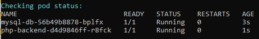
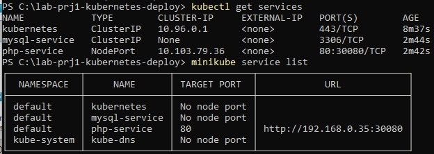
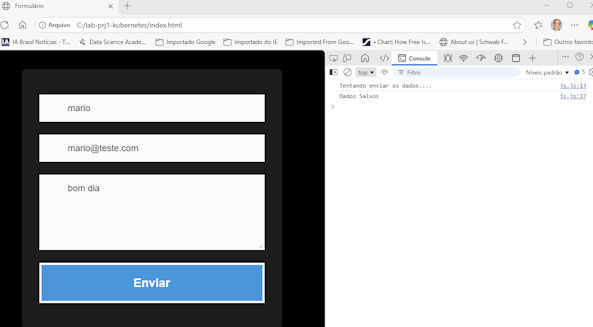

# Projeto 1- Kubernetes - criar um deploy

## - Objetivo:

 
Criar uma aplicação com um banco de dados e uma página web que permita remotamente inserir um registro no banco de dados,  utilizando como base arquivos fornecidos pelo professor Denilson Bonatti, disponíveis em github: https://github.com/denilsonbonatti/k8s-projeto1-app-base.

## - Meu ambiente de desenvolvimento:

Windows 11 / WSL2 - Ubuntu com Docker Desktop V 4.51.0, minikube V.1.37, kubectl V.1.34.1. IDE: Visual Studio Code + Copilot Pro; Terminal, Power Shell V.7.5.4, notepad++, GitHub Desktop.

##  - Aplicação:

        - um cluster com dois nós:
            - desktop-control-plane
            - desktop-worker

        - um container com php-apache (backend)
        - um container com MySQL
        - o MySQL container com nodePort (local, se fosse na nuvem - LoadBalancer)
        
        - frontend - formulário para novo registro no BD
        - backend - conecta com BD e insere novo registro

        - Definição do banco de dados

            nome: meubanco
            senha: Senha123
            tabela: 'mensagens', campos:
            
            id: INT PRIMARY KEY AUTO_INCREMENT,
            nome: VARCHAR(50)
            email: VARCHAR(50)
            comentario: VARCHAR(100)

## Considerações iniciais:

O projeto foi iniciado com W11/WLS2 + Docker Cesktop + Minikube em máquina local (rede local). Foi verificado que Minikube não disponibiliza IP externo de acordo com sua rede local, ele por 'default' disponibiliza 192.168.49.0/24. Poderia ter mudado o projeto com outras alternativas, nginx, ingress, proxy reverso, etc, ou utilizado a nuvem (AWS, GCP, Azure), mas queria criar ambiente local para outros projetos.

Logo, mantive a proposta inicial, até fazer upload das imagens (database e backend) para o Docker Hub. Depois executei um 'microkube delete'. Recriei o microkube com driver Hyper-V, fiz um Pull das imagens do Docker hub e funcionou na primeira tentativa (detalhe: o windows tem que ser versão PRO para ter acesso ao gerenciamento do Hyper-V para criar um 'MinikubeSwitch' (Virtual Switch).

Executar: 
minikube start --driver=hyperv --hyperv-virtual-switch="MinikubeSwitch"

## Passo a passo do processo (sugestão: leia, primeiro, todos os passos antes de executar):

- permitir nesta sessão executar scripts (Power Shell)

PS C:\lab-prj1-kubernetes-deploy> Set-ExecutionPolicy -Scope Process -ExecutionPolicy Bypass

- Executar: 

PS C:\minikube start --driver=hyperv --hyperv-virtual-switch="MinikubeSwitch"

- ir para a pasta onde está o seu projeto, no meu caso:

PS C:\> cd lab-prj1-kubernetes-deploy

PS C:\lab-prj1-kubernetes-deploy>

- carregar script para download de imagens

PS C:\lab-prj1-kubernetes-deploy> .\loadv2-from-dockerhub.ps1

....
final do script mostra vários dados (Pods, Services)

 

 

.....

- pedir informação do IP do php?backend para acessar o MySQL

C:\lab-prj1-kubernetes-deploy> minikube service php-service --url

- pedir a lista de serviços onde mostra IP externo do php

PS C:\lab-prj1-kubernetes-deploy> minikube service list

- olhar o nome do Pod Mysql (fornecido acima pelo script do download de imagens) e abrir Bash-5.1

PS C:\lab-prj1-kubernetes-deploy> kubectl exec --tty --stdin mysql-db-56b49b8878-x8vb7 -- /bin/bash

- Fazer login no MySQL

bash-5.1# mysql -u root -p

Enter password: (digitar senha: Senha123)

- abrir banco de dados

mysql> use meubanco;

#consultar tabela de mensagens

mysql> select * from mensagens;

- ir em outra máquina com a pasta frontend (copiada) e editar o arquivo 'js.js', para inserir o IP do 'php-service'.
- na linha 8  -> url: "http://192.168.0.31:30080"  (outro, o que aparecer quando consultou acima)

- ( ver imagem, abaixo) se quiser mais detalhes da comunicação quando abrir a pagina (dois clicks) index.html do frontend vá em "três pontos" (para configurações/controles do navegador) -> mais ferramentas -> Ferramentas de desenvolvedor, vai abrir aba à direita e deixe a opção/ferramenta console. Quando preencher formulário e clickar 'enviar', deve ver duas mensagens na console. Primeiro, 'Tentando enviar dados' e depois 'Dados salvos', se a comunicação teve sucesso.

- voltar à maquina com minikube (servidor) e consultar novamente a tabela 'mensagens' para ver o novo registro.
mysql> select * from mensagens;

- Happy coding!

 

## Imagens disponíveis em Docker Hub

---
docker pull marioltf/prj1-database:latest

docker pull marioltf/prj1-backend:latest

---

